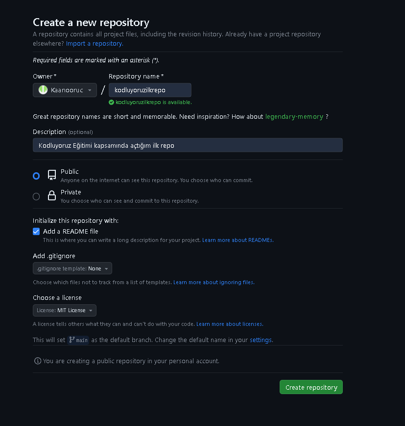

# KODLUYORUZ İLK REPO #

### Bu repo [kodluyoruz](https://kodluyoruz.org/) Front-End Eğitiminde oluşturduğumuz ilk repo.İçerisinde bir adet README dosyası,bir adet Index.html barındırıyor.



## INSTALLATION ##

Öncelikle projeyi clonelayalım.(Buraya sizin reponuzdan aldığınız link gelecek)

```
https://github.com/Kaanooruc/kodluyoruzilkrepo.git
```


# USAGE #

Projeyi cloneladıktan sonra Visual Studio Code programında açarız.

Linux için:

```
cd kodluyoruzilkrepo
code .
```

# CONTURIBUTING #

Pull requestler kabul edilir. Büyük değişiklikler için, lütfen önce neyi değiştirmek istediğinizi tartışmak için bir konu açınız.

# LICENSE #

[MİT](https://choosealicense.com/licenses/mit/
)
